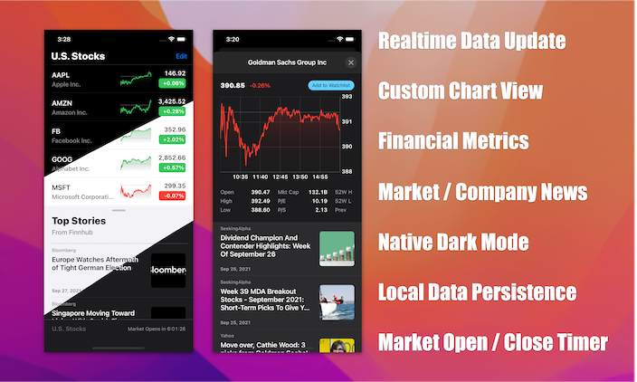

#  U.S. Stocks

Stay informed with your favorite stocks. 📈



*[Demo Video](https://www.youtube.com/watch?v=l8rljMK0dcI)*

## Data Source (API Key Required)

**To run this App, a valid API key needs to be provided.**
[Finnhub](https://finnhub.io/) is the data source of all stock quotes, price history and financial metrics used in this App.
Registration is quick and free. 
Go to [Finnhub](https://finnhub.io/) and register an account to generate the api key.
If you choose to apply for free tier option, API limits apply.

### API Limit

**Finnhub** offers free–tier option with rate, data types and data quantity limits.
Please refer to the [documentation](https://finnhub.io/docs/api/rate-limit) for detailed info.

If the API request limit is met, the error message will be printed in the console.
Refer to the printed message if you found the data cannot be retrieved correctly.

### API Key Installation

Place the key at the following location of the source code:

```
// Go to the file: stocks/Managers/APICaller.swift
// And find the following method...

final class APICaller {
private struct Constants {
static var apiKey = "PLACE-YOUR-API-KEY-HERE"
}
}
```
**Note: If the provided key is invalid, an error message will be printed when the data request is sent.**

## Issue Reporting

If you any issue is encountered with this App (I'm sure there is), feel free to create an issue ticket.
I'll try to fix it as soon as possible.
