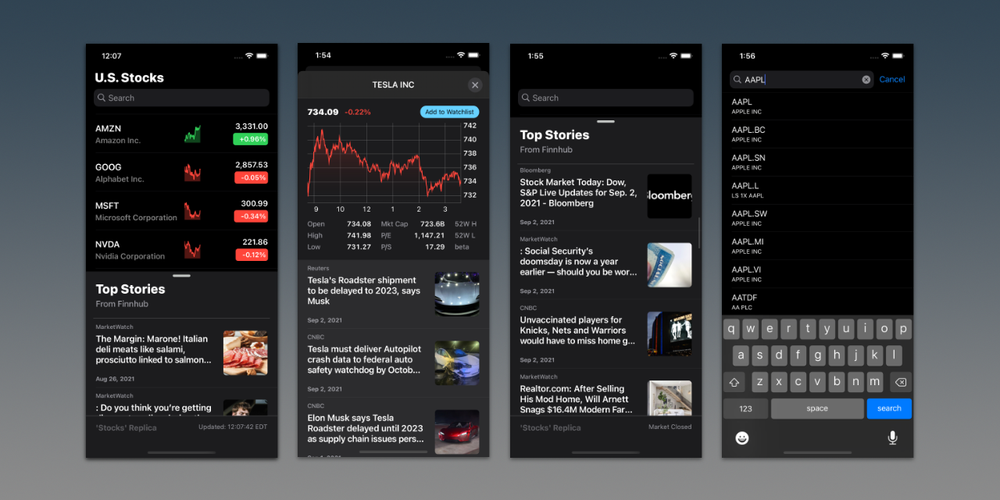

#  U.S. Stocks

U.S. Stocks is an iOS App for users to easily stay informed with their favorite stocks.



## Data Source

[Finnhub](https://finnhub.io/) is the data source of all stock quotes, price history and financial metrics used in this App.
**To run this App, a valid API key needs to be provided.**

## Required: Provide Your API Key

Go to [Finnhub](https://finnhub.io/) and register an account to generate the api key.
Please place the key at the following location of the source code:

```text
// Go to the file: stocks/Managers/APICaller.swift

final class APICaller {
    private struct Constants {
        static var apiKey = "PLACE-YOUR-API-KEY-HERE"
    }
}
```
If the provided key is invalid, an error message will be printed in the console.

### API Limit

**Finnhub** offers free–tier option with rate, data types and data quantity limits.
Please refer to the [documentation](https://finnhub.io/docs/api/rate-limit) for detailed info.

If the API request limit is met, the error message will be printed in the console.
Refer to the printed message if you found the data cannot be retrieved correctly.

## Error Reporting

If you encounter any issue with this App, feel free to create an issue ticket.
I'll try to fix it as soon as possible.
